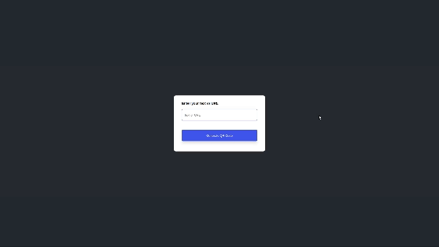

# Projects

<table>
  <tr>
    <td><strong>Weather App</strong></td>
    <td><strong>To-Do List</strong></td>
    <td><strong>Quiz App</strong></td>
  </tr>
  <tr>
    <td></td>
    <td></td>
    <td></td>
  </tr>
  <tr>
    <td><strong>Random Pwd Generator</strong></td>
    <td><strong>Notes App</strong></td>
    <td><strong>Age Calculator</strong></td>
  </tr>
  <tr>
    <td></td>
    <td></td>
    <td></td>
  </tr>
  <tr>
    <td><strong>Guess My Numer</strong></td>
    <td><strong>Quote Generator</strong></td>
    <td><strong>QR Code Generator</strong></td>
  </tr>
  <tr>
    <td></td>
    <td></td>
    <td></td>
  </tr>
  <tr>
    <td><strong>Modal Window</strong></td>
    <td><strong>Pig Game</strong></td>
    <td><strong>Snack Bar</strong></td>
  </tr>
  <tr>
    <td></td>
    <td></td>
    <td></td>
  </tr>
    <tr>
    <td><strong>Music Player</strong></td>
    <td><strong>Placeholder</strong></td>
    <td><strong>Placeholder</strong></td>
  </tr>
  <tr>
    <td></td>
    <td></td>
    <td></td>
  </tr>
</table>
