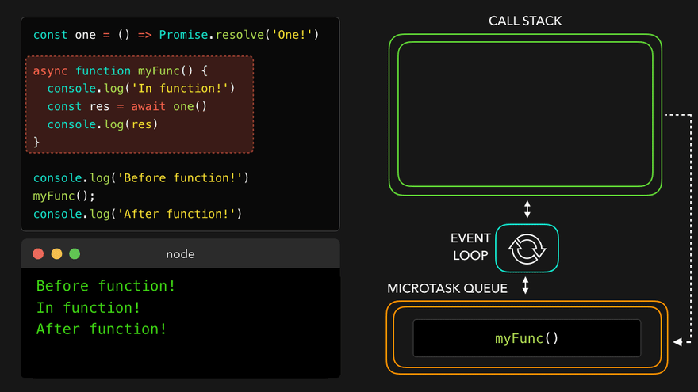

[How JavaScript Works Behind the Scenes -- by Jonas Schmedtmann](https://www.youtube.com/playlist?list=PLzyGb02PQ53l0Iy9tVMyYxTzl-0RRufzJ)

[How Does JavaScript Work Behind the Scenes? JS Engine and Runtime Explained](https://www.freecodecamp.org/news/how-javascript-works-behind-the-scenes/)

  

  
  

